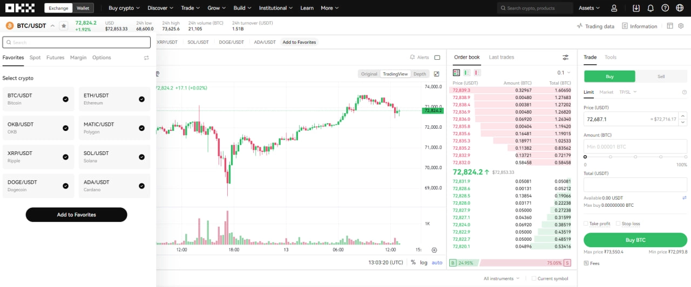

# Complete Guide to OKX: Registration, Trading, and Security for Crypto Investors

Looking for a reliable crypto exchange that won't leave you fumbling through confusing interfaces? OKX delivers institutional-grade trading tools with surprisingly straightforward onboarding—complete KYC verification in under 24 hours, sub-0.1% trading fees, and P2P transactions that actually work with your local currency. Whether you're making your first Bitcoin purchase or managing a six-figure portfolio, this platform combines depth with accessibility in ways most exchanges still haven't figured out.

---

OKX stands as one of the world's leading cryptocurrency exchanges, serving millions of investors globally with a comprehensive financial ecosystem. Founded in 2014 and headquartered in Hong Kong, this platform has rapidly evolved into a major force in the crypto industry. What sets OKX apart isn't just its massive trading volume—it's the breadth of services spanning from basic spot trading to sophisticated derivatives and passive income opportunities.

The platform's credibility is backed by significant investments from renowned venture capital funds including Giant Network Group, Longling Capital, Ceyuan Ventures, and VenturesLab (co-founded by Tim Draper). This financial firepower helps OKX maintain its position among the top global crypto exchanges by trading volume and coin diversity.

Security and innovation drive OKX's mission to democratize finance through cryptocurrency. The platform continuously upgrades its technology, delivering optimal user experiences while safeguarding customer assets. The goal? Making advanced financial services accessible to everyone, transparently and easily.

## What Makes OKX's Product Suite Stand Out

OKX isn't just another place to buy and sell crypto—it's a complete financial ecosystem designed for diverse user needs. This variety is what keeps the platform competitive in an increasingly crowded market.

### Spot Trading: The Foundation

Spot trading represents the most straightforward way to buy or sell cryptocurrencies like Bitcoin, Ethereum, and hundreds of altcoins at current market prices. OKX's spot interface combines intuitive design with advanced charting tools, technical indicators, and flexible order types (Limit, Market, Stop-Limit) that help traders make precise decisions without the learning curve you'd expect from such powerful features.

### Derivatives: For Serious Traders

Professional traders looking to optimize returns or hedge risk will find OKX's derivatives suite remarkably robust. Futures contracts let you trade asset prices at predetermined future levels. Perpetual swaps offer futures-style trading without expiration dates—perfect for leveraged positions. Options provide rights (not obligations) to buy or sell assets at specific prices, opening sophisticated hedging strategies. These instruments offer substantial profit potential but carry proportional risk, demanding solid knowledge before jumping in.

### Lending & Staking: Passive Income Made Simple

OKX turns idle crypto into earning assets through lending and staking services. Lending allows you to earn interest by providing liquidity to other users. Staking involves locking tokens to support blockchain networks in exchange for rewards. Both options suit investors who want portfolio growth without constant active trading.

### OKX Earn: Maximizing Returns

The OKX Earn platform aggregates multiple financial products, letting users optimize returns across different risk profiles and time horizons. Products include flexible savings, fixed-term deposits, yield farming, and various earning opportunities. Whether you're a beginner or experienced investor, OKX Earn helps extract maximum value from your crypto portfolio.

### NFT Marketplace & GameFi Integration

Staying ahead of Web3 trends, OKX has integrated an NFT marketplace and GameFi support, enabling users to explore, trade unique digital assets, and participate in blockchain gaming. This demonstrates OKX's commitment to innovation, constantly expanding services to embrace emerging blockchain sectors.

### P2P Trading: Local Currency Flexibility

OKX's peer-to-peer trading feature enables direct crypto transactions between users using fiat currencies (like VND) through local payment methods. This brings significant flexibility and convenience, especially for users in regions with strict crypto regulations. 👉 [Start P2P trading with zero fees and instant local payment options](https://www.okx.com/join/47044926) while OKX's escrow system protects both buyers and sellers.

## Quick and Secure Account Registration

Getting started on OKX is straightforward, but security remains paramount throughout the process. Always use trusted links to avoid phishing sites that could compromise your assets.

Visit the official OKX homepage and click the "Sign Up" button. You can register using either email or phone number, though email typically offers faster verification. Enter your email address in the provided field.

After clicking "Sign up," OKX immediately sends a 6-digit verification code to your email. You'll have 60 seconds to check your inbox (including spam folders) and enter this code. Click "Next" to proceed.

The system then requires phone number verification through a similar code process. This two-step authentication adds an essential security layer to your account.

Finally, create a strong password combining uppercase and lowercase letters, numbers, and special characters. Choose something memorable to you but difficult for others to guess. **Never share your password with anyone**, including supposed OKX staff members. Password protection is your personal responsibility for keeping assets safe.

## KYC Verification: Why It Matters and How to Complete It

Know Your Customer (KYC) verification is a critical security process on OKX that complies with international financial regulations while protecting users from fraudulent activities. While OKX doesn't mandate full verification, it directly impacts withdrawal limits and account security levels.

### Understanding KYC Requirements

KYC helps OKX verify user identities, ensuring compliance with anti-money laundering (AML) and counter-terrorism financing (CTF) regulations while protecting your assets from unauthorized access. Fully verified accounts enjoy higher security and fewer transaction restrictions.

### OKX's Verification Tiers

OKX structures verification into multiple levels with corresponding withdrawal limits:

**Unverified Accounts**: Zero withdrawal capability—essentially making KYC mandatory for practical platform use.

**Level 1 Verification (Basic)**: 0.5 BTC daily withdrawal limit, requiring basic personal information like name, birth date, and nationality.

**Levels 2 & 3 (Advanced)**: Up to 100 BTC daily withdrawals. These levels require government-issued ID photos (national ID, driver's license, or passport) plus facial recognition verification. Limits may increase based on trading history and account activity.

Note that if you maintain multiple sub-accounts, only one receives KYC verification. We recommend completing at least Level 2 verification to maximize account security and withdrawal flexibility for future needs.

### Step-by-Step Verification Process

Access your OKX account, click the profile icon, and navigate to "Verification." Choose between personal or business account verification, then select "Verify Identity" to begin.

OKX prompts you to select your identification document type: driver's license, national ID card, passport, or citizen ID. After selecting, the system guides you through scanning both sides of your chosen document, followed by facial recognition to match your ID photo with your actual appearance. This prevents identity theft and ensures accuracy.

Level 2 and 3 applications require review time—typically a few hours to one business day. If verification takes longer than expected, contact OKX customer support for assistance.

### Benefits of Higher Verification Levels

Completing advanced KYC doesn't just raise withdrawal limits—it strengthens account security, reduces hijacking risks, and unlocks full platform access without restrictions. This compliance-focused approach builds a safer, more transparent trading environment for the entire OKX community.

## Securing Your Account With Two-Factor Authentication (2FA)

Security is paramount in crypto trading, and two-factor authentication (2FA) provides essential account protection. OKX offers multiple 2FA methods, with Google Authenticator and SMS verification being most common. Setting up 2FA is mandatory for maximum asset security.

### Google Authenticator Setup and Usage

Google Authenticator generates time-based one-time codes—the recommended security method for your OKX account. Setup works on both mobile devices and computers.

Access your OKX account, click the profile icon, navigate to "Security," find "Authenticator App," and select "Set up."

If you haven't installed Google Authenticator, download it from the Apple App Store or Google Play Store. OKX may provide a QR code for quick app downloads.

After installing Google Authenticator, open the app and tap the "+" button in the bottom right corner to add a new account. Point your phone camera at the QR code displayed on your OKX screen. The app automatically scans the code and generates a 6-digit 2FA code that refreshes every 30-60 seconds.

**Critical step**: Save the QR code or "Setup key" provided. This is your account recovery key if you lose your phone or can't access Google Authenticator. Without this key, account recovery becomes extremely difficult and time-consuming.

Finally, enter the verification code from Google Authenticator along with a code sent to your registered phone number or email to activate this feature. Input these codes and confirm to complete the process.

### Activating SMS 2FA on OKX

Besides Google Authenticator, enable SMS 2FA for an additional security layer. In the "Security" section, find "Two-factor authentication (2FA)" and select "Turn on." OKX requires confirmation by entering codes sent via SMS to your phone number plus codes from your Authenticator app.

Click "Send code" to receive the SMS code, then enter it in the corresponding field and confirm. Using both 2FA methods creates a more robust protective shield for your OKX account.

### Why 2FA Matters in Crypto Security

Two-factor authentication is critically important in the cryptocurrency world. It adds a protection layer beyond passwords, preventing bad actors from accessing your account even if they've obtained your password. 2FA codes constantly change and remain valid only briefly, making attacks significantly more difficult. Activating 2FA is a basic responsibility for every investor to protect digital assets on OKX and any other platform.

## Efficient Deposits and Withdrawals on OKX

After registration and account security setup, the next step is depositing funds to start trading or withdrawing profits. The deposit and withdrawal process on OKX is straightforward but demands extreme caution, especially when selecting blockchain networks to avoid asset loss.

### How to Deposit Crypto to OKX

To deposit cryptocurrency into your OKX account, follow these steps:

1. **Access Assets**: From the OKX main interface, find and click "Assets."
2. **Select Deposit**: In the options list under "Assets," choose "Deposit."
3. **Choose Coin/Token**: You'll see a cryptocurrency list. Select the coin or token you want to deposit (e.g., USDT, BTC, ETH).
4. **Select Chain (Network)**: This is an extremely important step. Choose the correct network matching where you're sending funds from. For example, if sending USDT via TRC20 network, you must select TRC20 on OKX. Wrong network selection can result in total fund loss.
5. **Click Next and Copy Wallet Address**: After selecting the correct chain, click "Next." OKX displays your deposit wallet address and a QR code. Copy this address or scan the QR code using your source wallet or exchange app.
6. **Execute Transfer**: Paste the copied wallet address into the send field on your source wallet or exchange and confirm the transaction. Funds will arrive in your OKX account depending on blockchain network processing speed.

### How to Withdraw Crypto From OKX

The withdrawal process mirrors deposits and demands absolute accuracy:

1. **Access Assets**: From the OKX main interface, find and click "Assets."
2. **Select Withdraw**: In the options list under "Assets," choose "Withdraw."
3. **Choose Coin/Token**: Select the coin or token you want to withdraw.
4. **Select Method and Chain**: Choose withdrawal method (typically via on-chain wallet address) and once again, **select the correct network (chain)** matching your receiving wallet. If withdrawing USDT to a BSC (BEP20) supporting wallet, you must select BEP20 on OKX.
5. **Click Next and Enter Withdrawal Address**: After selecting the correct chain, click "Next." You'll be asked to enter your receiving wallet address. Double-check this address multiple times to ensure accuracy.
6. **Confirm Withdrawal**: Enter the amount of coin/token to withdraw and confirm the transaction by entering 2FA verification codes (from Google Authenticator and/or SMS) as required by OKX.

### Critical Notes for Deposits and Withdrawals

**Carefully Check Network (Chain)**: This is the most common error causing unrecoverable asset loss. Always ensure the network you select on OKX matches the network of the wallet or exchange you're interacting with.

**Transaction Fees**: Each deposit/withdrawal includes a network fee. Check this fee before executing transactions.

**Withdrawal Limits**: Ensure you've completed appropriate KYC levels to withdraw according to your needs.

**Processing Time**: Blockchain transactions require time for confirmation. Be patient and check transaction status in OKX's deposit/withdrawal history.

Mastering crypto deposits and withdrawals on OKX is a fundamental skill every trader needs to manage assets safely and efficiently.

## Spot Trading Guide on OKX

Spot trading represents the most popular form of cryptocurrency buying and selling, allowing you to actually own coins/tokens. To start trading on OKX, you must transfer funds from your Funding Account to your Trading Account.

### Transferring Funds From Funding to Trading Account

When depositing money to OKX, funds typically land in your "Funding Account." To trade, transfer these funds to your "Trading Account." Here's how:

1. **Access Assets**: Click "Assets" on the main interface.
2. **Select My assets**: In the dropdown menu, choose "My assets" to view your asset overview.
3. **Click Transfer**: Find and click the "Transfer" button.
4. **Set up transfer**:
   - **From**: Select "Funding account"
   - **To**: Select "Trading account"
   - **Coin**: Choose the coin/token you want to transfer
   - **Amount**: Enter the quantity to transfer
5. **Complete transfer**: Click "Transfer" to confirm. Funds transfer instantly and you can begin trading.

### Executing Spot Trading Orders

With funds in your Trading Account, proceed with spot trading:

1. **Access trading interface**: From the main interface, click "Trade" and select "Spot" to enter the spot trading interface.
2. **Search trading pairs**: On the left side of the trading screen, you'll see a currency pair list. Use the search bar to find the coin/token you want to buy or sell (e.g., BTC/USDT, ETH/USDT).
3. **Choose order type**: In the order panel (typically lower right), you can select different order types:
   - **Limit Order**: Lets you buy or sell at a specific desired price. Orders only execute when market price reaches that level.
   - **Market Order**: Buy or sell immediately at the best available market price.
   - **Stop-Limit Order**: A more complex order combining stop and limit features, commonly used for stop-loss or take-profit strategies.
4. **Enter order details**:
   - For Limit Orders, enter your desired buy/sell price and coin/token quantity.
   - For Market Orders, just enter the quantity or total value you want to trade.
5. **Place order**: Click the corresponding green/red "Buy" or "Sell" button.

### Monitoring Placed Orders and Trading History

After placing orders, track their status:

**Open Orders**: Your Limit or Stop-Limit orders appear here until fully executed or canceled.

**Order History**: When an order executes or gets canceled, it moves to order history where you can view all completed transaction details.

Mastering spot trading is the foundation for participating in the cryptocurrency market on OKX. Always start with small capital and thoroughly understand order types and market analysis before executing large trades.

## P2P Trading on OKX: Direct USDT Transactions With Local Currency

OKX's peer-to-peer (P2P) trading allows users to buy and sell cryptocurrency directly with each other using fiat currencies like VND through local banking methods. This flexible and convenient method proves especially useful for converting between fiat and cryptocurrency.

### How to Buy USDT Via P2P on OKX

To purchase USDT with VND via P2P on OKX, follow these steps:

1. **Access P2P Trading**: From the OKX main interface, hover over "Buy crypto" and select "P2P trading."
2. **Choose seller**: The screen displays various sellers with different prices and trading limits. Select sellers with appropriate pricing and high transaction completion rates to ensure reliability. Note the "Limit/Available" section showing minimum and maximum VND amounts that seller accepts per transaction.
3. **Start buying**: Click the "Buy" button next to your chosen seller.
4. **Enter amount**: Input the USDT quantity you want to buy. The system automatically displays the corresponding VND amount you need to pay. Then select "Buy USDT with 0 fees" to continue.
5. **Make payment**: The seller's bank payment information appears on screen. Transfer the corresponding VND amount to the seller's account within the specified timeframe (typically 15 minutes). Ensure you input the correct transfer reference as required by OKX for quick processing.
6. **Confirm payment**: After completing the bank transfer, return to OKX and click "Transferred, next" followed by "Confirm." OKX holds the seller's USDT in escrow and waits for seller confirmation of payment receipt. When the seller confirms, USDT transfers to your OKX account.

### How to Sell USDT Via P2P on OKX

To sell USDT for VND via P2P on OKX, access "P2P trading" as when buying.

1. **Choose buyer**: Switch to the "Sell" tab and select an appropriate buyer. Similarly to buying, prioritize buyers with high completion rates and large order volumes.
2. **Start selling**: Click the "Sell" button next to your chosen buyer.
3. **Enter amount**: Input the USDT quantity you want to sell. The system displays the VND amount you'll receive. Then select "Sell USDT with 0 fees."
4. **Wait for buyer payment**: After placing your sell order, OKX holds your USDT in escrow. The buyer has a specified timeframe to transfer VND to your bank account.
5. **Check and confirm payment receipt**: **Very important**: After receiving notification from OKX that the buyer has transferred funds, you **must log into your bank account to carefully verify** the money has actually arrived. Never release coins before confirming funds in your account.
6. **Release coins**: Once you've confirmed full payment receipt, return to OKX and click "Confirm" or "Release crypto" to unlock USDT and transfer to the buyer.

### Safe P2P Trading Tips on OKX

**Check trading partner reputation**: Always prioritize selecting sellers/buyers with high completion rates and large order volumes. OKX typically displays this information.

**Never trade outside the platform**: All communication and confirmation must occur within OKX's P2P interface to ensure escrow system protection.

**Verify bank account**: This is the most important protective step when selling USDT. Always verify the balance in your bank account before releasing coins.

**Communicate clearly**: If any issues arise, use OKX's chat feature to contact your trading partner or OKX support team.

P2P trading is a powerful tool on OKX but requires caution and adherence to security rules to avoid fraud risks.

---

OKX has proven its position as one of the world's leading cryptocurrency exchanges, with a diverse product ecosystem and superior features. From basic spot trading to complex derivatives, along with passive financial services and Web3 integration, OKX provides a comprehensive platform for all crypto investor needs. The tightly designed registration, KYC verification, and 2FA security processes ensure user asset safety. Detailed guidance on coin deposits/withdrawals and P2P trading helps users easily access and operate efficiently on the platform. With competitive trading fees and continuous innovation commitment, 👉 [OKX remains the ideal choice for anyone wanting to participate in the cryptocurrency market](https://www.okx.com/join/47044926) with confidence and professional-grade tools that actually deliver on their promises.
